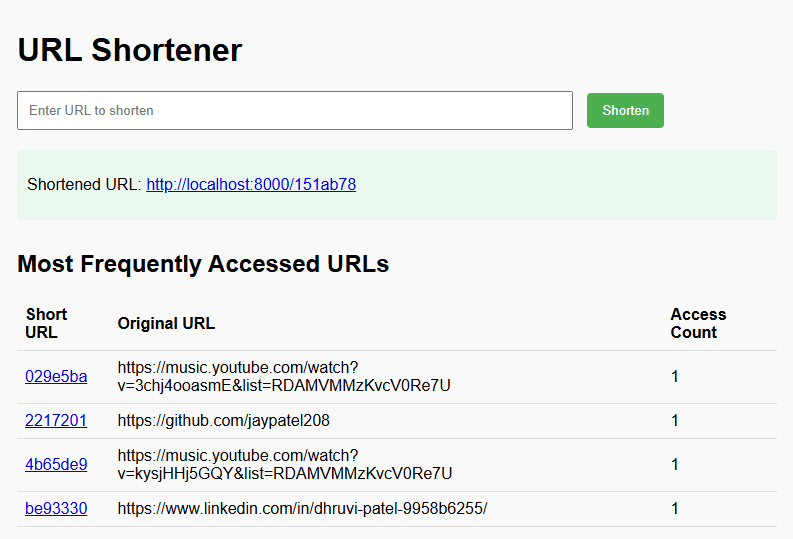

# URL Shortener

A professional URL shortener application that implements various advanced data structures.

<div align="center">
  
</div>

## Features

- URL shortening with unique hash generation
- Fast URL lookup and redirection
- Tracking of most frequently accessed URLs using a heap
- Balanced search trees (Red-Black Tree) for ordered URL storage
- Cuckoo hashing for efficient collision handling
- Persistent storage of data structures
- Web interface for easy interaction

## Data Structures Implemented

1. **Hash Tables**
   - Basic hash table for URL mapping
   - Cuckoo hash table for collision resolution

2. **Heaps**
   - Min heap for tracking most frequently accessed URLs

3. **Balanced BSTs**
   - Red-Black Tree implementation for ordered URL storage

## Installation

1. Clone the repository
2. Install dependencies:
   ```
   pip install -r requirements.txt
   ```
3. Run the application with python main.py
4. Access the URL shortener at http://localhost:8000

## Running the Application

```
python main.py
```

The application will be available at http://localhost:8000

## Project Structure

```
url-shortener/
│
├── main.py              # Main FastAPI application
├── bst.py               # Red-Black Tree implementation
├── requirements.txt     # Project dependencies
├── data/                # Data storage directory
│   ├── url_data.pkl     # URL mapping persistence
│   ├── url_counter.pkl  # Access counter persistence
│   └── url_tree.pkl     # BST persistence
│
└── templates/           # HTML templates
    └── index.html       # Main web interface
```

## API Endpoints

- `GET /` - Web interface for URL shortening
- `POST /shorten` - Endpoint to shorten a URL
- `GET /{short_url}` - Redirect to the original URL
- `GET /stats/popular` - Get most popular URLs

## Scaling Options

This implementation can be extended for distributed scenarios by:

1. Implementing a consistent hashing scheme for multiple servers
2. Using a distributed cache like Redis for the URL mapping
3. Implementing a load balancer for request distribution